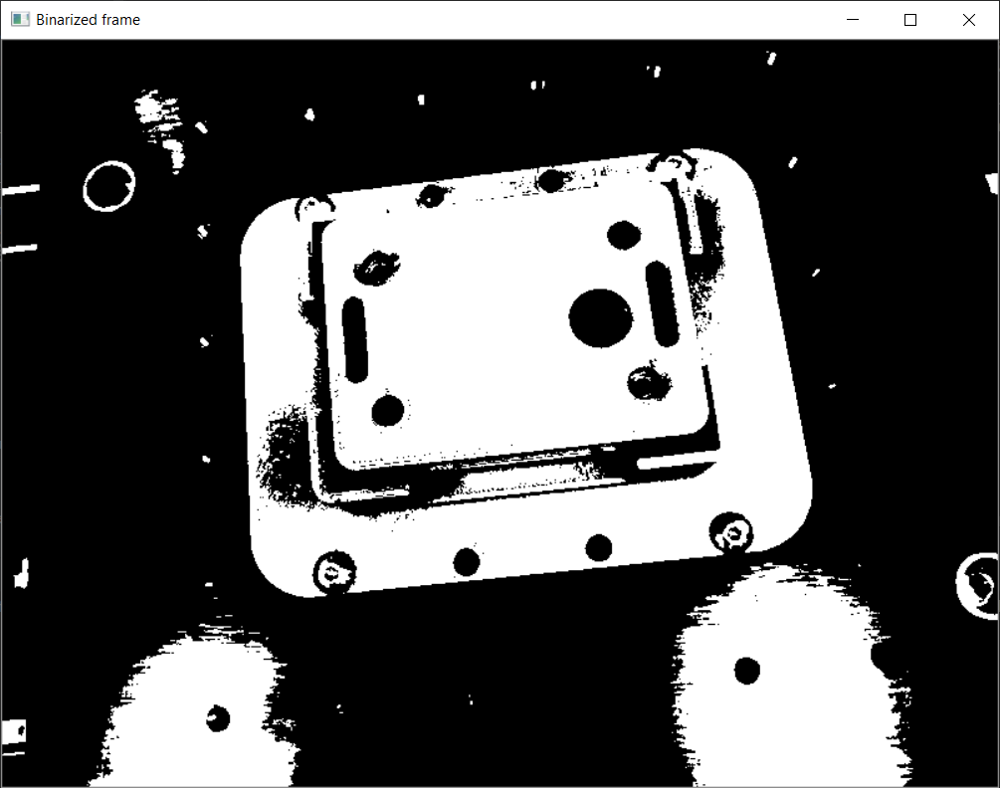

# TirocinioKuka
This repository contains the developed code during my 6-CFU traineeship at UniVR. It's part of a project aimed at recognizing holes on a 3D printed gadget and insert screws in them using the Kuka Robot.

_Initial project objectives:_
- Given a plastic 3D printed gadget, localize it, find the threaded holes;
- Once the centers are detected, map 2D pixels into 3D coordinates;
- Plan the Kuka Robot motion accordingly to insert screws into the threaded holes.

_In the following, a brief explanation of the (last) developed code (markerless approach):_
1) Read the camera frame, find the area of interest (base with holes)

  

3) Detect the holes inside the area of interest using OpenCV Blob Detection (https://learnopencv.com/blob-detection-using-opencv-python-c/)
4) Filter the detected holes considering the ones inside the area of interest (and keep only unique holes among multiple frames for increased robustness)
5) Make a graph from the pixels' centers coordinates and find the best path for the robot to follow (optional: only 2 threaded holes should be detected on the gadget)
6) Try to map 2D pixel coordinates into 3D points using camera parameters matrices
7) TO DO/CHECK (it's only pseudocode) if reliable: Control the robot in order to reach the center of the "k-th" hole; try to use the above 2D->3D projections; probably a second alignment process is required afterwards
